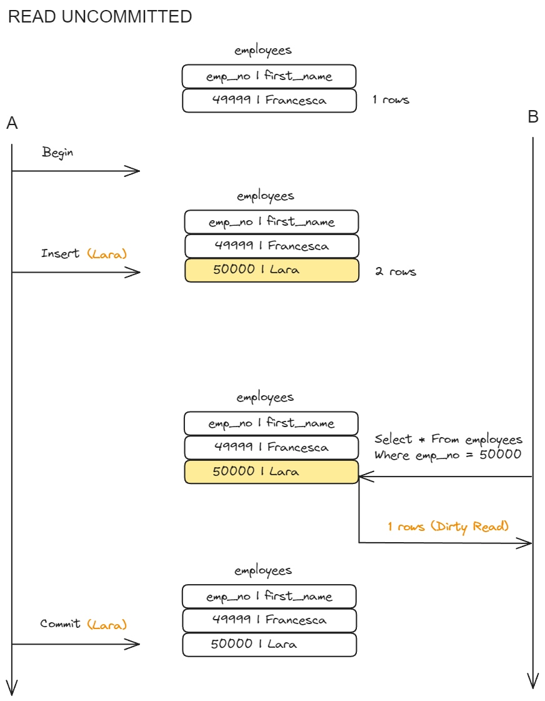
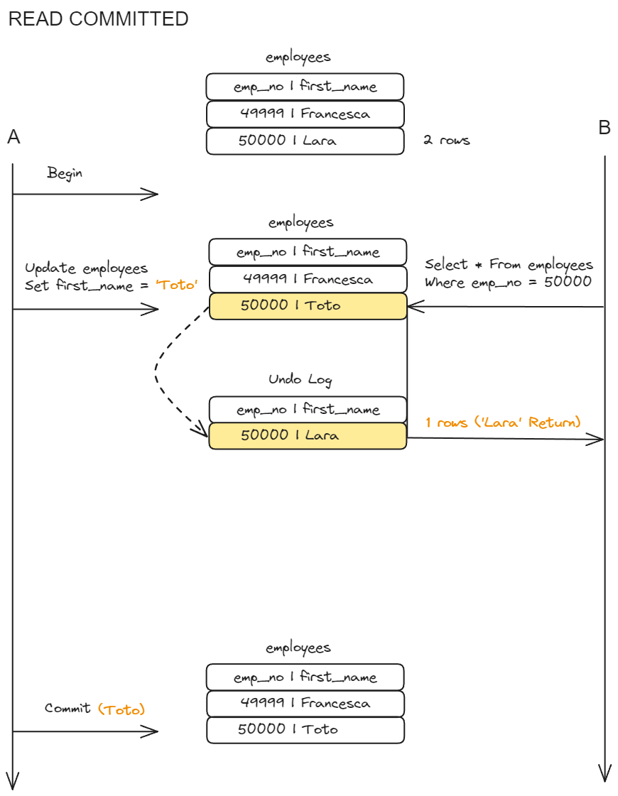
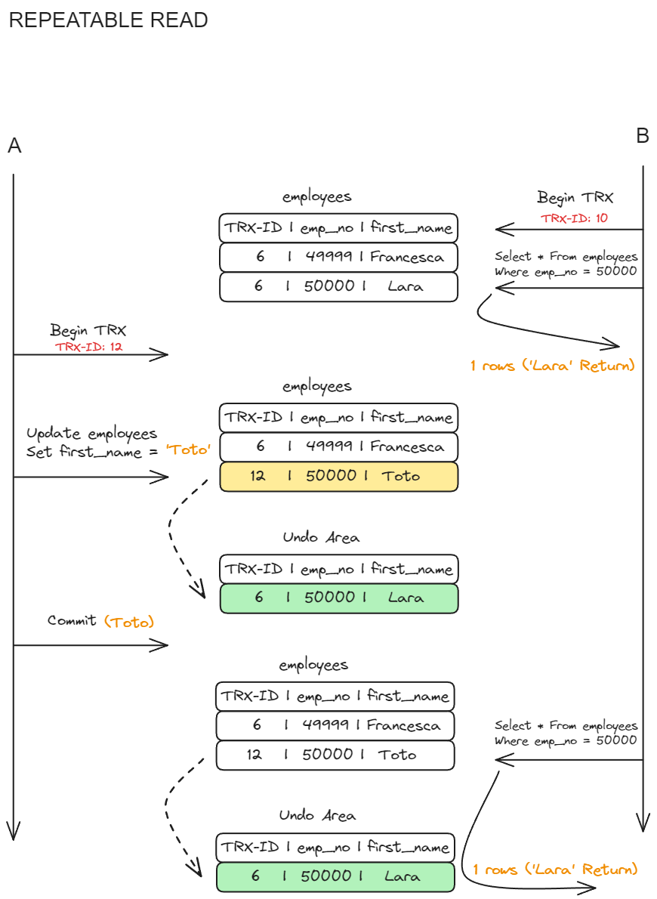
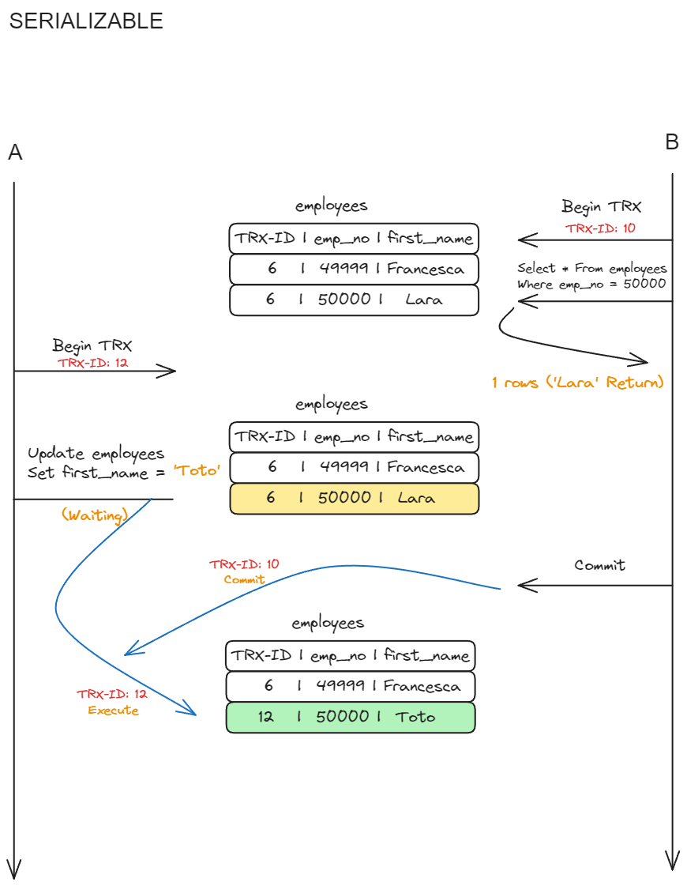

### 📌소개

데이터베이스를 공부하다보면 많은 개념과 용어들이 나온다. 그 중에서 대표적으로 데이터베이스의 네 가지 특징인 **ACID**와 **Transaction(트랜잭션)**, **Index(인덱스)** 등이 있다. 이번 시간에는 데이터베이스의 **Transaction과 Transaction isolation level(트랜잭션의 격리 수준)**에 대해 학습한다.

---

### 🚀ACID

- **`Atomic(원자성)`**
  - **원자성**은 **전체가 실행되거나 전혀 실행되지 않아야 한다는 원칙**을 의미한다.  
    즉, 트랜잭션은 하나의 논리적인 작업 단위로 간주되며, 모든 연산이 성공적으로 완료되거나 실패할 경우 롤백되어 이전 상태로 복원되어야 한다.
- **`Consistency(일관성)`**
  - **일관성**은 **트랜잭션이 실행되기 전과 후에 데이터베이스가 일관된 상태를 유지해야 함**을 의미한다.  
    즉, 트랜잭션은 데이터베이스의 일관성 규칙을 준수해야 하며, 데이터베이스가 일관성 있는 상태로 유지되는 것을 보장해야 한다.
- **`Isolation(고립성)`**
  - **고립성**은 **여러 트랜잭션이 동시에 실행될 때 각 트랜잭션이 다른 트랜잭션에 영향을 받지 않아야 함**을 의미한다.  
    즉, 한 트랜잭션이 실행 중일 때 다른 트랜잭션이 해당 데이터에 접근하거나 변경할 수 없어야 한다.
- **`Durability(지속성)`**
  - **지속성**은 **성공적으로 완료된 트랜잭션의 결과가 영구적으로 저장되어야 함**을 의미한다.  
    즉, 시스템 장애 또는 전원 장애가 발생하더라도 데이터베이스는 지속적으로 복구되어야 하며, 트랜잭션이 커밋되면 해당 변경 사항은 영구적으로 보존되어야 한다.

### 🚀Transaction

- **`Trasnaction (트랜잭션)`**
  - **트랜잭션**은 데이터베이스에서 수행되는 **작업의 논리적 단위**다. 여러 개의 쿼리가 함께 실행되어 데이터베이스의 상태를 변경할 때, 이러한 작업들을 하나의 트랜잭션으로 묶어서 처리한다. 트랜잭션은 데이터베이스 시스템에서 **데이터의 무결성을 보장하고, ACID 속성을 준수**하는 데 중요한 역할을 한다.

### 🚀Transaction Isolation Level (트랜잭션 격리 수준)

- Transaction Isolation Level (트랜잭션 격리 수준)
  - **트랜잭션 격리 수준엔 4가지 레벨**이 있다.  
    **READ UNCOMMITTED, READ COMMITTED, REPEATABLE READ, SERIALIZABLE**  
    밑에 표는 각 레벨별 발생할 수 있는 **격리 수준 관련 문제**들을 나타낸다.

|                      | <center>DIRTY READ</center> | <center>NON - REPEATABLE READ</center> | <center>PHANTOM READ</center> |
| :------------------- | :-------------------------: | :------------------------------------: | :---------------------------: |
| **READ UNCOMMITTED** |              O              |                   O                    |               O               |
| **READ COMMITTED**   |              X              |                   O                    |               O               |
| **REPEATABLE READ**  |              X              |                   X                    |      O (InnoDB는 발생 X)      |
| **SERIALIZABLE**     |              X              |                   X                    |               X               |

- **DIRTY READ** : 어떤 트랜잭션에서 처리한 작업이 완료되지 않았는데도 다른 트랜잭션에서 볼 수 있게 되는 현상이다.
- **NON - REPEATABLE READ** : 하나의 트랜잭션 내에서 똑같은 SELECT 쿼리를 실행했을 때는 항상 같은 결과를 가져야하는데 (이를 REPEATABLE READ 정합성 이라 함) 이 정합성이 깨지는 것을 뜻 한다.
- **PHANTOM READ** : 다른 트랜잭션에서 수행한 변경 작업에 의해 레코드가 보였다가 안 보였다가 하는 현상이다.

### 💻MySQL 실습

- Docker로 MySQL을 띄운다.

```bash
docker run -it --name db001 -e MYSQL_ROOT_PASSWORD=db001 -d mysql:latest    # MySQL 최신 버전을 daemon으로 실행
docker exec -it db001 bash                                                  # bash 쉘 접속
mysql -uroot -p                                                             # MySQL 클라이언트 접속
create database testdb;                                                     # MySQL에서 사용할 테스트용 데이터 베이스 생성
use testdb;                                                                 # 방금 만든 테스트용 데이터 베이스 사용

CREATE TABLE employees(                                                     # 직원 테이블 생성
emp_no int(10) NOT NULL AUTO_INCREMENT,
first_name VARCHAR(20) NOT NULL,
CONSTRAINT employees_PK PRIMARY KEY (emp_no)
);

mysql> show tables;                                                         # 잘 생성 되었는지 확인
+------------------+
| Tables_in_testdb |
+------------------+
| employees        |
+------------------+
1 row in set (0.00 sec)

insert into employees(emp_no, first_name) values(49999, 'Francesca');    # 테스트용 데이터 추가

mysql> select * from employees;                                          # 데이터 확인
+--------+------------+
| emp_no | first_name |
+--------+------------+
|  49999 | Francesca  |
+--------+------------+
1 rows in set (0.00 sec)


mysql> show variables like 'transaction_isolation';                         # 트랜잭션 격리 수준 확인
+-----------------------+-----------------+
| Variable_name         | Value           |
+-----------------------+-----------------+
| transaction_isolation | REPEATABLE-READ |
+-----------------------+-----------------+
1 row in set (0.01 sec)

```

- MySQL에 접속한 클라이언트 세션에 대한 격리수준 설정 방법

```bash
SET SESSION TRANSACTION ISOLATION LEVEL READ UNCOMMITTED; # READ_UNCOMMITTED
SET SESSION TRANSACTION ISOLATION LEVEL READ COMMITTED;   # READ_COMMITTED
SET SESSION TRANSACTION ISOLATION LEVEL REPEATABLE READ;  # REPEATABLE READ
SET SESSION TRANSACTION ISOLATION LEVEL SERIALIZABLE;     # SERIALIZABLE
```

### **⭐READ UNCOMMITTED**

- 각 트랜잭션에서의 변경 내역이 **COMMIT, ROLLBACK 여부에 상관없이 다른 트랜잭션에서 보여진다(Dirty Read)**. 정합성에 문제가 많은 격리수준이며, 권장되지 않는 격리수준이다.



1. 터미널을 두개 띄워서 각 세션의 **Transaction Isolation Level**을 **READ UNCOMMITTED**로 변경 한다.

   ```bash
   # 1번, 2번 각 Terminal
   SET SESSION TRANSACTION ISOLATION LEVEL READ UNCOMMITTED; # READ_UNCOMMITTED로 설정
   SHOW VARIABLES LIKE 'transaction_isolation';              # 격리수준 체크

   mysql> SHOW VARIABLES LIKE 'transaction_isolation';
   +-----------------------+------------------+
   | Variable_name         | Value            |
   +-----------------------+------------------+
   | transaction_isolation | READ-UNCOMMITTED |
   +-----------------------+------------------+
   1 row in set (0.00 sec)
   ```

2. 먼저 **1번 터미널에 띄워둔 MySQL서버의 트랜잭션을 시작**한다.  
   그 뒤 **emp_no=50000, first_name='Lara'를 가지는 사원을 추가**한다.  
   아직 **1번 터미널의 트랜잭션은 끝나지 않은 상태**로 둔다.

   ```bash
   # 1번 터미널
   mysql> select * from employees;                                     # 트랜잭션 시작 전 데이터 1건 확인
   +--------+------------+
   | emp_no | first_name |
   +--------+------------+
   |  49999 | Francesca  |
   +--------+------------+
   1 rows in set (0.00 sec)

   START TRANSACTION;                                                  # 트랜잭션 시작
   INSERT INTO employees(emp_no, first_name) VALUES(50000, 'Lara');    # 새 사원 추가
   ```

3. **2번 터미널에 띄워둔 MySQL 서버**에서  
   '**SELECT emp_no, first_name FROM employees**' 쿼리를 실행 한다.

   ```bash
   # 2번 터미널
   mysql> select * from employees;  # 2번 터미널에서 데이터 확인
   +--------+------------+
   | emp_no | first_name |
   +--------+------------+
   |  49999 | Francesca  |
   |  50000 | Lara       |
   +--------+------------+
   2 rows in set (0.00 sec)
   ```

   - 1번 터미널의 트랜잭션이 끝나기도 전에 다른 트랜잭션에서 커밋돼지 않은 정보를 읽을 수 있다.  
     **Dirty Read 발생**

4. **1번 터미널의 트랜잭션**을 **COMMIT** 한다.

   ```bash
   # 1번 터미널
   COMMIT;
   ```

5. **READ_UNCOMMITTED 격리 수준**은 트랜잭션이 시작되고 커밋되지 않은 데이터에 접근 가능하다.

### **⭐READ COMMITTED**

- Oracle DBMS의 기본 격리수준이다. 온라인 서비스에서 가장 많이 선택되는 격리수준이며, **Dirty Read**는 발생하진 않지만 **READ COMMITTED** 격리수준에서도 **NON-REPEATABLE READ** 부정합 문제가 발생할 수 있다.



1. **READ UNCOMMITTED**격리수준 실습 때 띄어놓은 두 개의 터미널을 그대로 사용한다.
   각 세션의 **Transaction Isolation Level**을 **READ COMMITTED**로 변경한다.

   ```bash
   # 1번, 2번 각 Terminal
   SET SESSION TRANSACTION ISOLATION LEVEL READ COMMITTED; # READ_COMMITTED로 설정
   SHOW VARIABLES LIKE 'transaction_isolation';              # 격리수준 체크

   mysql> SHOW VARIABLES LIKE 'transaction_isolation';
   +-----------------------+----------------+
   | Variable_name         | Value          |
   +-----------------------+----------------+
   | transaction_isolation | READ-COMMITTED |
   +-----------------------+----------------+
   1 row in set (0.00 sec)
   ```

2. **1번 터미널**에 띄워둔 MySQL서버의 **트랜잭션을 시작**한다.  
   **'SELECT \* FROM employees'** 쿼리로 조회한다.

   ```bash
   # 1번 터미널
   START TRANSACTION;                                               # 1번 터미널 트랜잭션 시작

   mysql> select * from employees;                                  # 트랜잭션 시작 후 데이터 2건 확인
   +--------+------------+
   | emp_no | first_name |
   +--------+------------+
   |  49999 | Francesca  |
   |  50000 | Lara       |
   +--------+------------+
   2 rows in set (0.00 sec)
   ```

3. **2번 터미널**에 띄워둔 MySQL서버의 **트랜잭션을 시작**한다.  
   **'SELECT \* FROM employees'** 쿼리로 조회한다.

   ```bash
   # 2번 터미널
   START TRANSACTION;                                               # 2번 터미널 트랜잭션 시작

   mysql> select * from employees;                                  # 트랜잭션 시작 후 데이터 2건 확인
   +--------+------------+
   | emp_no | first_name |
   +--------+------------+
   |  49999 | Francesca  |
   |  50000 | Lara       |
   +--------+------------+
   2 rows in set (0.00 sec)
   ```

4. 다시 **1번 터미널**에서 '**UPDATE employees SET first_name="Toto" WHERE first_name="Lara"**' 쿼리를 실행한다.  
   아직 **1번 터미널의 트랜잭션은 끝나지 않은 상태**로 둔다.

   ```bash
   # 1번 터미널
   UPDATE employees SET first_name="Toto" WHERE first_name="Lara";  # UPDATE 쿼리 실행
   ```

5. **2번 터미널**에서 **다시 조회**한다.

   ```bash
   # 2번 터미널
   mysql> SELECT * FROM employees;
   +--------+------------+
   | emp_no | first_name |
   +--------+------------+
   |  49999 | Francesca  |
   |  50000 | Lara       |
   +--------+------------+
   2 rows in set (0.00 sec)
   ```

   - 1번 터미널의 트랜잭션이 끝나기 전에는 다른 트랜잭션에서 커밋돼지 않은 정보를 읽을 수 없다.
     **Dirty Read 발생 X**

6. **1번 터미널 트랜잭션 COMMIT**한다.

   ```bash
   # 1번 터미널
   mysql> COMMIT;                        # 1번 터미널 트랜잭션 COMMIT
   Query OK, 0 rows affected (0.04 sec)
   ```

7. **2번 터미널**에서 **다시 조회**한다.

   ```bash
   # 2번 터미널
   mysql> SELECT * FROM employees;   # 1번 터미널 COMMIT 후 재 조회
   +--------+------------+
   | emp_no | first_name |
   +--------+------------+
   |  49999 | Francesca  |
   |  50000 | Toto       |
   +--------+------------+
   2 rows in set (0.01 sec)
   ```

   - **NON-REPEATABLE READ**부정합 문제 발생(같은 트랜잭션 내에서 SELECT 쿼리의 결과는 항상 동일 해야함)

8. **2번 터미널 트랜잭션 COMMIT**한다.

   ```bash
   # 2번 터미널
   mysql> COMMIT;                        # 2번 터미널 트랜잭션 COMMIT
   Query OK, 0 rows affected (0.04 sec)
   ```

9. **READ COMMITTED 격리수준**에선 **Dirty Read** 부정합은 발생하지 않지만, **NON-REPEATABLE READ** 부정합은 발생한다.

### **⭐REPEATABLE READ**

- **MySQL InnoDB**의 기본 **격리수준**이다.  
  바이너리 로그를 가진 MySQL 장비에선 최소 **REPEATABLE READ** 격리수준 이상을 사용 해야 한다.  
  **NON-REPEATABLE READ** 부정합 문제가 발생 하지 않는다.  
  **InnoDB 스토리지 엔진**은 트랜잭션이 ROLLBACK될 가능성에 대비해 변경되기전 레코드를 **Undo 영역**에 백업 해두고, 실제 레코드 값을 변경한다.**(MVCC - Multi Version Concurrency Control)**  
  **Undo 영역에 백업된 데이터**는 InnoDB 스토리지 엔진이 필요없다고 판단되는 시점에 **주기적으로 삭제**한다. (JVM GC와 비슷 한 듯)



1. **READ UNCOMMITTED**격리수준 실습 때 띄어놓은 두 개의 터미널을 그대로 사용한다.  
   각 세션의 **Transaction Isolation Level**을 **REPEATABLE READ**로 변경 해준다.

   ```bash
   # 1번, 2번 각 Terminal
   SET SESSION TRANSACTION ISOLATION LEVEL REPEATABLE READ; # READ_COMMITTED로 설정
   SHOW VARIABLES LIKE 'transaction_isolation';              # 격리수준 체크

   mysql> SHOW VARIABLES LIKE 'transaction_isolation';
   +-----------------------+-----------------+
   | Variable_name         | Value           |
   +-----------------------+-----------------+
   | transaction_isolation | REPEATABLE-READ |
   +-----------------------+-----------------+
   1 row in set (0.00 sec)
   ```

2. **이번엔 2번 터미널에 띄워둔 MySQL서버의 트랜잭션을 먼저 시작**한다.  
   2번 터미널에서 '**SELECT \* FROM employees WHERE emp_no=50000**' 쿼리로 조회한다.

   ```bash
   # 2번 터미널
   START TRANSACTION;                                               # 2번 터미널 트랜잭션 시작

   mysql> SELECT * FROM employees WHERE emp_no=50000;
   +--------+------------+
   | emp_no | first_name |
   +--------+------------+
   |  50000 | Lara       |
   +--------+------------+
   1 row in set (0.00 sec)
   ```

3. **1번 터미널**에 띄워둔 MySQL서버의 **트랜잭션을 시작**한다.  
   **1번 터미널**에서 **'UPDATE employees SET first_name='Toto' WHERE emp_no=50000'** 쿼리를 실행한다.  
   **1번 터미널**의 **트랜잭션을 COMMIT**한다.

   ```bash
   # 1번 터미널
   START TRANSACTION;                                                # 1번 터미널 트랜잭션 시작
   UPDATE employees SET first_name='Toto' WHERE emp_no=50000;        # UPDATE 쿼리 실행
   COMMIT;                                                           # 1번 터미널 트랜잭션 커밋
   ```

4. **2번 터미널**에서 **다시 조회**한다.  
   '**SELECT \* FROM employees WHERE emp_no=50000**' 쿼리를 실행한다.

   ```bash
   # 2번 터미널
   mysql> SELECT * FROM employees WHERE emp_no=50000;
   +--------+------------+
   | emp_no | first_name |
   +--------+------------+
   |  50000 | Lara       |
   +--------+------------+
   1 row in set (0.00 sec)
   ```

   - 1번 터미널의 트랜잭션이 끝났지만, 2번 터미널에서 재 조회시 처음 조회했던 결과를 그대로 얻는다. (**NON-REPEATABLE READ 부정합 발생 X**)

5. **2번 터미널 트랜잭션 COMMIT**한다.

   ```bash
   # 2번 터미널
   mysql> COMMIT;                        # 2번 터미널 트랜잭션 COMMIT
   Query OK, 0 rows affected (0.04 sec)
   ```

6. **2번 터미널 COMMIT 후 다시 조회**한다.

   ```bash
   # 2번 터미널
   mysql> SELECT * FROM employees WHERE emp_no=50000;
   +--------+------------+
   | emp_no | first_name |
   +--------+------------+
   |  50000 | Toto       |
   +--------+------------+
   1 row in set (0.00 sec)
   ```

   - 이제 1번 트랜잭션의 결과가 반영된 수정된 레코드 값이 보인다.

7. **REPEATABLE READ 격리수준**에선 **Dirty Read** 부정합 문제와 **NON-REPEATABLE READ** 부정합 문제는 발생하지 않는다.

### **⭐SERIALIZABLE**

- 가장 단순한 격리수준이지만 **가장 엄격한 격리수준**이다.  
  간단한 SELECT 쿼리와 같은 **읽기 작업**에서 조차 **읽기 잠금을 획득**해야한다.  
  **(동시성 ↓, 데이터 격리성 ↑)**  
  **격리 수준 관련 문제**가 발생하지 않는다.



1. **SERIALIZABLE 격리수준**에선 실행중인 TRX-ID(트랜잭션 아이디)보다 **빠른 TRX-ID**가 있다면 해당 트랜잭션이 **커밋 되거나 롤백**될때까지 **대기** 후 실행된다.  
   따라서 동시성이 많이 요구되는 환경에서 Lock이 걸릴 수 있으며 성능에 치명적일 수 있다.

---

### 📝마무리

- 데이터베이스의 4가지 특징과 트랜잭션 격리 수준에 대해 알아봤다. 머리로만 이해하던 내용을 직접 실습으로 익혀보니 좀 더 이해가 잘됐던 거 같다. 각각의 격리 수준에 대한 특징에 대해 알아둔다면 추후 격리 수준을 선택하는 상황에서 적절한 선택을 할 수 있을 것이다.

---

### 🌐References

- [Real MySQL8.0](https://wikibook.co.kr/realmysql801/)

---
